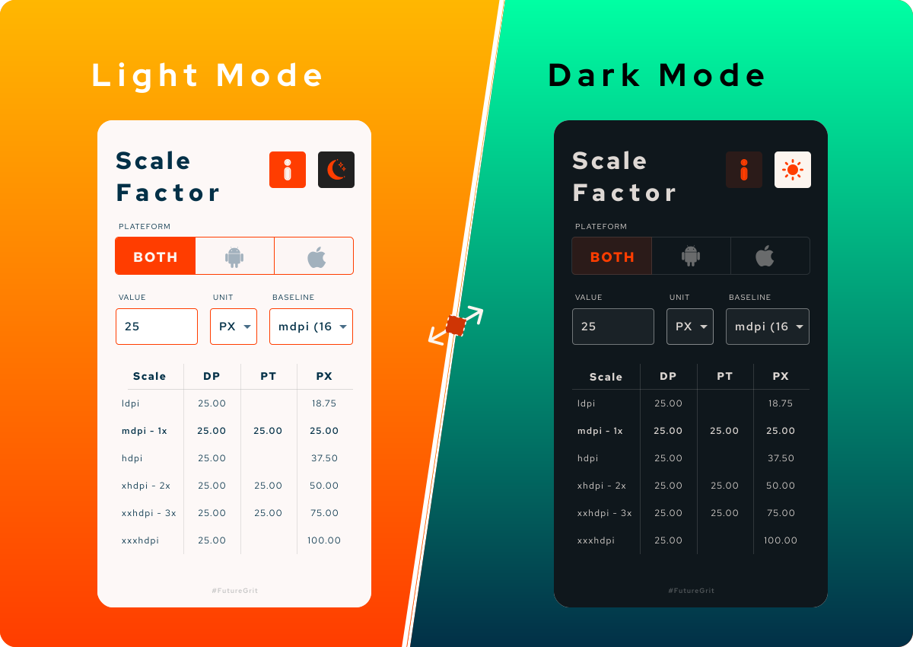

# Scale Factor 
***Create perfect design for all.***

Scale Factor is simple tool for converting pixel values between densities supported by android and iOS devices.

* Instantly convert a pixel dimension to all the densities supported by Android and iOS.
* Useful for mobile application developers and UI designers.

   &nbsp; 
  

 

## Roadmap
* Implementation of "Information" Screen:
    - iOS Design Guide
    - Android Design Guide
* Testing